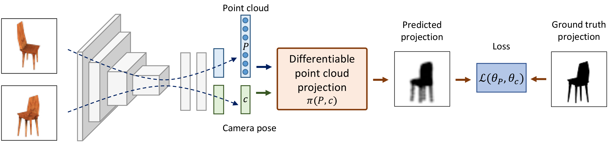

# Unsupervised Learning of Shape and Pose with Differentiable Point Clouds
Eldar Insafutdinov and Alexey Dosovitskiy.  
Neural Information Processing Systems, 2018.

Website: https://http://eldar.insafutdinov.com/PointClouds  
Paper: https://arxiv.org/abs/1810.09381  



## Setup

### Install dependencies
The code is in Python 3.6 and Tensorflow >= 1.11. We provide instructions on how to install all dependencies with conda, but using pip should also work. We suggest downloading miniconda for python 3.

Create Python 3.6 environment (some packages are not yet available for the more recent python 3.7):

```bash
conda create -n py36 python=3.6
conda activate py36
```
Install basic dependencies:

```bash
conda install numpy scikit-image pillow scipy scikit-learn pyyaml
pip install easydict
```

Install open3d (more information can be found on the [official website](http://www.open3d.org/docs/getting_started.html#installing-from-pypi-or-conda)):

```bash
conda install -c open3d-admin open3d
```

Install TensorFlow:
```bash
pip install tensorflow-gpu
```

### Prepare training data
We use [Shapenet v1](https://www.shapenet.org) for all experiments in the paper.

For convenience, we provide the rendered images, used for training, for the chair, car and airplane classes of the ShapeNet dataset (category ID `03001627`, `02958343` and `02691156` respectively):

```bash
cd data
./download_train_data.sh 03001627
```

Convert training images to TFRecords format:

```bash
./create_tf_records.sh 03001627
```

Download pre-computed ground truth point clouds for evaluation:

```bash
./download_ground_truth.sh 03001627
```

You can also generate ground truth yourself as described [here](dpc/densify/README.md).

### Train and Evaluate

<p align="center">
    
</p>

To train and evaluate the full model without camera pose supervision execute the following:

```bash
cd experiments/chair_unsupervised
# train and compute accuracy on the validation set
python ../../dpc/run/train_eval.py
# compute accuracy on the test set
python ../../dpc/run/predict_eval.py --eval_split=test
```

You can use a `--gpu` flag to specify an ID of the GPU you want to run on.

The file `chamfer_pred_test.txt` contains the accuracy of 3D shape reconstruction represented by the two quantities: coverage and precision. Chamfer distance metric is the sum of precision and coverage. More details on the evaluation metric can be found in the [paper](https://arxiv.org/pdf/1810.09381.pdf#section.5). 

The file `pose_error_pred_test.txt` contains camera pose estimation error. The first quantity is accuracy at the 30° threshold and the second one is the median error in degrees.

A configuration file to train a model with camera pose supervision is located in `experiments/chair_camera_supervision`.


### Visualise

We provide a Jupyter notebook to visualise predicted shapes. The rendering code uses Blender, which you can install in the `external/` subdirectory under name `blender` or simply create a symlink, for example:

```bash
ln -s /path/to/blender-2.79b external/blender
```

After, you can lunch the notebook `experiments/visualise.ipynb`.

## Citation

```
@inproceedings{insafutdinov18pointclouds,
title = {Unsupervised Learning of Shape and Pose with Differentiable Point Clouds},
author = {Insafutdinov, Eldar and Dosovitskiy, Alexey},
booktitle = {Advances in Neural Information Processing Systems (NeurIPS)},
year = {2018}
}
```
